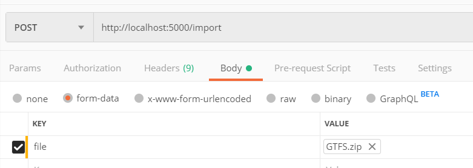

# About GTFS2CrateDB

Welcome to GTFS2CrateDB.io. Motivation of this project is to provide basic import functionality of GTFS feed into [CrateDB](https://crate.io). Application itself represents REST service with a single endpoint to upload GTFS feed and import it into CrateDB.

## Installation

Make sure that you have installed [Docker Desktop](https://www.docker.com/products/docker-desktop) on your local machine before moving further.

### Demo purpose

The easiest way to spin up the whole application without installing any runtimes and dependencies is to run it within docker container. In the root of the project you may find `docker-compose.yml` file. This file contains definition of insfrastructure in term of dockerized application. By running a command:

```
docker-compose up
```
GTFS2CrateDB application is being deployed within Docker container and becomes available for POST request to send GTFS feed by the following URL `http://localhost:5000/import`.
Postman example:



### Development purpose

For running application in development mode following components have to be pre-installed:

- [Python](https://www.python.org) 3.7.2
- [pipenv](https://pypi.org/project/pipenv/) 2018.11.2

After installing above components, following command have to be executed from the project root to finish installation of project dependencies:

```
pipenv install
```

That's it!

Last step is to execute command to run the application:

```
python src/server.py
```

This command starts Flask service and make it available for POST request to send GTFS feed by the following URL `http://localhost:5000/import`

Last point in this section is to run CrateDB as a persistance storage in container, to let service import GTFS feed:

```
docker run -p "4200:4200" crate
```

CrateDB instance gets spinned up and become accessible for the import service.

## Performance improvements

As a potential performance improvements following tasks have to be taken into account for the nearest future:

- Split upload of GTFS feed from actual import into CrateDB
- Implement import of GTFS feed into CrateDB in the background task as it's a long-running  process
- Import each GTFS feed file from Zip archive in a separate background task (see [parse_single_file](./server/application/gtfs_feed))
- Adjust environment variable `IMPORT_ROWS_PER_QUERY_AMOUNT` to achieve best performance during inserting into CrateDB, as this might be the bottleneck

## Technical improvements

As a potential improvements following tasks have to be taken into account for the nearest future:

- As `csv` library of Python parse integer values from GTFS feed as string, [pandas.read_csv](https://pandas.pydata.org/pandas-docs/stable/reference/api/pandas.read_csv.html) has to be considered as alternative.
- Centralize place to handle application exceptions
- Add tests
- Add authentication between import service and CrateDB
- Improve logging
- Add CI to build and run tests on each commit
